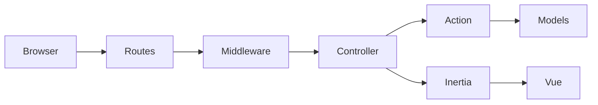

# Architecture

This document is for **contributors**. It describes how an authenticated request becomes a ledger change: domains, actions, team scoping, and the public/instance edges.

Operator install and upgrades: [INSTALL.md](INSTALL.md), [SELF_HOST.md](SELF_HOST.md) (including [multi-tenant hardening](SELF_HOST.md#multi-tenant-hardening)), [UPGRADE.md](UPGRADE.md).  
Local setup: [DEVELOPMENT.md](DEVELOPMENT.md).  
Roles and permission keys: [TEAM_ACCESS.md](TEAM_ACCESS.md).

nrth is a **self-hosted, multi-team** Laravel 13 + Inertia/Vue app. A Jetstream **team** is a business. The signed-in user’s `current_team_id` is the tenant for almost all product data.

## Request flow



1. **Route** — `routes/web.php` (Wealth routes in [`app/Modules/Wealth/routes/web.php`](../app/Modules/Wealth/routes/web.php)).
2. **Middleware** — session auth (`auth:sanctum` + Jetstream), optional `verified`, idle timeout, Inertia share, Spatie role sync, onboarding redirect. Optional modules also use `team.module:{name}`.
3. **Controller** — `app/Http/Controllers/Web/…` stays thin: `$this->authorizeTeam('…')`, `abort_unless($model->team_id === $user->current_team_id, 403)`, validate, call an action, `Inertia::render` or `back()->with('success', …)`.
4. **Action** — `app/Domain/{Context}/Actions/*Action.php` owns writes (usually inside `DB::transaction`). DTOs carry input. Services do calculations and I/O that are not a single write (totals, PDF, ledger balances, CSV parse).
5. **UI** — Vue 3 pages under `resources/js/Pages/`. Success/error feedback is [toast-only](../.cursor/rules/ui-patterns.mdc) (`ToastHost` + session `success` / `error` / `warning` / `info`).

Public pay links and payment webhooks skip the authenticated group (see [Unauthenticated edges](#unauthenticated-edges)).

## Directory map

| Path | Role |
|------|------|
| [`app/Domain/`](../app/Domain/) | Product logic: actions, DTOs, models, services, enums |
| [`app/Http/Controllers/Web/`](../app/Http/Controllers/Web/) | HTTP adapters (Inertia + redirects) |
| [`app/Support/`](../app/Support/) | Cross-cutting helpers (TeamAccess, modules, currencies, upgrade policy) |
| [`app/Models/`](../app/Models/) | Jetstream `User` / `Team` / `TeamRole` |
| [`app/Modules/Wealth/`](../app/Modules/Wealth/) | Bounded optional module (own routes, migrations, provider) |
| [`resources/js/Pages/`](../resources/js/Pages/) | Inertia page components, grouped like the domains |
| [`routes/web.php`](../routes/web.php) | Authenticated app + public pay + webhooks |
| [`tests/Feature/`](../tests/Feature/) | HTTP and action tests; isolation and reports live in named folders |

Do **not** grow Spatie `ledger.*` ability strings or Jetstream abilities for new product auth. Use TeamAccess ([TEAM_ACCESS.md](TEAM_ACCESS.md)).

## Domains

Business logic lives under `app/Domain/{Context}/`. Typical layout inside a context:

```
Actions/   # one write use-case per class, `execute(…)`
DTOs/
Models/
Services/
Enums/
Exceptions/   # when needed
```

| Context | Owns |
|---------|------|
| **Accounting** | Chart of accounts, journal transactions, journal lines, suppliers, posting/void, ledger balances, P&L |
| **Invoicing** | Clients, invoices, estimates, items, recurring, payments, PDFs, online pay sessions |
| **Banking** | Bank accounts (linked to GL), statement import, imported lines, recon match/exclude |
| **Expenses** | Receipt parse helpers used by the expenses UI (posted expenses are accounting transactions) |
| **Tax** | VAT rates/periods/returns, provisional-tax scaffolding |
| **Takeout** | Team data export jobs (Settings → Backups & exports) |
| **Backup** | Instance backup runs (operator / `./scripts/backup`) |
| **Instance** | Install-wide operators, mail, timezone, backup retention |
| **Vehicles** | Travel: vehicles, trips, licence reminders, trip imports |
| **Budgeting** | Planning: category budgets |
| **Contracting** | Client contracts and retainer invoice generation (early) |
| **Ai** | Provider catalog used by receipt/document/trip import |
| **Shared** | [`HasTeamScope`](../app/Domain/Shared/HasTeamScope.php) / [`TeamScope`](../app/Domain/Shared/Scopes/TeamScope.php) |

**Accounting vs banking:** the journal is the book. Imported bank lines are a matching layer. Reconciliation stores allocations in cents and points at posted accounting transactions; it does not rewrite the ledger.

**Invoice send:** sending or marking sent posts an accrual (Dr AR, Cr income + VAT when registered). Later payments clear AR only when that accrual exists.

## Actions, DTOs, services

Keep controllers free of multi-step writes.

```php
// Controller: authorize, validate, map DTO, call action
$this->authorizeTeam('invoices.manage', $request);
abort_unless($invoice->team_id === $request->user()->current_team_id, 403);

$recordPaymentAction->execute(new RecordPaymentDTO(/* … */));

return back()->with('success', __('Payment recorded.'));
```

```php
// Action: team-scoped load, invariants, persist, post journal
public function execute(RecordPaymentDTO $dto): Payment
{
    return DB::transaction(function () use ($dto): Payment {
        $invoice = Invoice::queryWithoutTeamScope()
            ->where('team_id', $dto->teamId)
            ->findOrFail($dto->invoiceId);
        // …
    });
}
```

- **Action** — named after a user intention (`CreateInvoiceAction`, `PostTransactionAction`, `AllocateBankingTransactionAction`). Constructor-inject services. Throw `ValidationException` for user-fixable errors.
- **DTO** — immutable input from HTTP (or another action). Do not pass `Request` into the domain.
- **Service** — reusable queries and calculations (`LedgerService`, `ProfitLossReportService`, `InvoiceTotalsCalculator`). Reports HTTP live in [`ReportsController`](../app/Http/Controllers/Web/ReportsController.php) and call those services.
- **Posting** — [`PostTransactionAction`](../app/Domain/Accounting/Actions/PostTransactionAction.php) will not post an unbalanced journal. Voiding posts a reversal and marks the original void; the ledger still sees both so they net out ([`LedgerService`](../app/Domain/Accounting/Services/LedgerService.php)).

Some screens (especially expenses) still contain more SQL in the controller than the ideal. New money-moving behaviour should go through an action.

## Money

Ledger, invoices, expenses, and recon allocations store **integer cents**. Eloquent money columns use [`MoneyCast`](../app/Domain/Accounting/Casts/MoneyCast.php) (`brick/money`). Compare and persist minor units via `getRawOriginal('amount_cents')`, not the `Money` object.

Bank **import** rows keep decimal amount columns for statement fidelity. Do not mix those with ledger cents except at an explicit conversion (`BankingMoney` helpers).

Default book currency is ZAR; invoices may snapshot a business-currency total for FX.

## Team scoping

Two layers, both required:

| Layer | What it does |
|-------|----------------|
| **TeamScope** | Global Eloquent scope: `where team_id = auth()->user()->current_team_id`. Unauthenticated **HTTP** queries match nothing (`1 = 0`). |
| **TeamAccess** | Permission keys (`invoices.view`, `banking.manage`, …). `$this->authorizeTeam('…')` → 403. |

Implicit route binding (`Invoice $invoice`) uses TeamScope, so another business’s id usually **404**s. Controllers still `abort_unless(… team_id …)` after authorize. Isolation tests accept **403 or 404**.

### `queryWithoutTeamScope()`

Most domain writes **opt out** of the global scope and filter `where('team_id', $dto->teamId)` themselves. Reasons:

- Console and queued jobs often have **no signed-in user**. TeamScope then **does not filter** (`runningInConsole()` skips the `1 = 0` guard). An unscoped `Model::query()` in a command can see every business.
- Child rows (journal lines) may not have `team_id`; they hang off a scoped parent.
- Explicit `team_id` is the authorization boundary. The global scope is a safety net for accidental `Invoice::all()` in an HTTP request, not a substitute for `authorizeTeam` + `where('team_id', …)`.

When you load by id in an action or job:

```php
Invoice::queryWithoutTeamScope()
    ->where('team_id', $teamId)
    ->findOrFail($invoiceId);
```

Tests: [`tests/Feature/TenantIsolation/`](../tests/Feature/TenantIsolation/) (business A vs B), [`tests/Feature/TeamAccess/`](../tests/Feature/TeamAccess/) (Viewer vs Accountant on one team).

## Optional modules

Catalog: [`ModuleCatalog`](../app/Support/Modules/ModuleCatalog.php) — `travel`, `planning`, `contracting`, `wealth`. Toggle per team under **Settings → Features** (`team_modules`). Disabled modules drop out of nav and return **403**; data is not deleted. New businesses start with all four **off**.

| Module | Code | Route gate |
|--------|------|------------|
| Travel | `app/Domain/Vehicles` | `team.module:travel` |
| Planning | `app/Domain/Budgeting` | `team.module:planning` |
| Contracting | `app/Domain/Contracting` | `team.module:contracting` |
| Wealth | `app/Modules/Wealth` | `team.module:wealth` (registered in `WealthServiceProvider`) |

Wealth is the template for a future bounded module (own migrations, routes, Inertia pages). Travel / Planning / Contracting still live under `app/Domain`.

## Instance vs team

| Concern | Where |
|---------|--------|
| Business data, roles, modules | Current Jetstream team |
| Operators, outbound SMTP, instance timezone, server backups | **Settings → Instance** / `app/Domain/Instance` / `app/Domain/Backup` |
| Team data takeout | Settings → Backups & exports (`app/Domain/Takeout`) |

The first installed user is an instance operator. Public registration is disabled by default. Operator break-glass: `NRTH_OPERATOR_EMAILS`. This is **not** TeamAccess.

## Files

Invoice PDFs, expense receipts, payment receipts, and signed contracts use Spatie Media Library on `MEDIA_DISK` (default `local` → `storage/app/private`). They are not served via `public/storage`. Logos stay on the `public` disk. `./scripts/update` runs `nrth:move-media-to-private-disk` for existing public files.

## Unauthenticated edges

These routes are outside the logged-in group. They must not trust `current_team_id`.

| Surface | Mechanism |
|---------|-----------|
| Public invoice pay `/pay/{token}` | Opaque 32-hex token; [`PublicInvoicePayController`](../app/Http/Controllers/Web/PublicInvoicePayController.php) loads invoices with `queryWithoutTeamScope()` |
| Stripe / PayFast webhooks | `/webhooks/payments/{provider}/{team}` — CSRF excluded for those two path prefixes in [`bootstrap/app.php`](../bootstrap/app.php); team from the URL, not the session. Completion loads the invoice with `queryWithoutTeamScope()` and row lock. Stripe verifies `Stripe-Signature` with the team webhook secret. PayFast verifies ITN MD5 with the **required** merchant passphrase (sandbox is off unless `PAYFAST_SANDBOX=true`). |
| Signed team invitation | `/invitations/{invitation}` — temporary signature (7 days) |

## Frontend

- Inertia v2 + Vue 3 + Tailwind v4 + Ziggy named routes.
- Shared props (current team, `team_permissions`, flash toasts) come from [`HandleInertiaRequests`](../app/Http/Middleware/HandleInertiaRequests.php). Hide nav/CTAs when a permission is missing; the server still 403s.
- UI patterns (tables, buttons, form footers, toasts): [`.cursor/rules/ui-patterns.mdc`](../.cursor/rules/ui-patterns.mdc).

## Tests that document the money path

| Suite | Asserts |
|-------|---------|
| [`tests/Feature/TenantIsolation/`](../tests/Feature/TenantIsolation/) | Business B cannot read or mutate business A |
| [`tests/Feature/Reports/`](../tests/Feature/Reports/) | P&L, trial balance, balance sheet, cash flow on a known journal |
| [`tests/Feature/Invoicing/InvoiceOverpaymentTest.php`](../tests/Feature/Invoicing/InvoiceOverpaymentTest.php) | Payment cannot exceed amount due |
| [`tests/Feature/TeamAccess/`](../tests/Feature/TeamAccess/) | Viewer/custom role 403s |

Schema from **2026-08-18** is additive only — see [UPGRADE.md](UPGRADE.md) and [CONTRIBUTING.md](../CONTRIBUTING.md).
