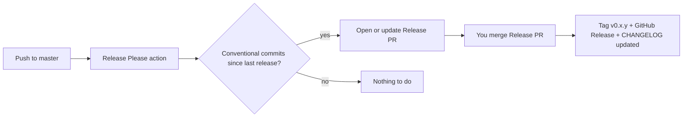

# Releases

nrth uses [Release Please](https://github.com/googleapis/release-please) to automate version bumps, [CHANGELOG.md](../CHANGELOG.md), GitHub Releases, and git tags. You should not edit the changelog by hand for routine releases.

## How it works



1. Commits on `master` use [Conventional Commits](https://www.conventionalcommits.org/) (`feat:`, `fix:`, `docs:`, etc.).
2. The [release-please workflow](../.github/workflows/release-please.yml) opens (or updates) a PR titled **`chore: release 0.x.y`** with an updated changelog and version files.
3. When you **merge that PR**, Release Please creates the git tag, publishes the GitHub Release, and commits the final changelog entry.

No manual tag commands or release note writing for normal releases.

## Commit message format

Release Please reads commit messages to build the changelog and decide semver bumps (while `0.x.y`):

| Prefix | Changelog section | Version bump (0.x) |
|--------|-------------------|--------------------|
| `feat:` | Features | Minor (`0.1.0` → `0.2.0`) |
| `fix:` | Bug Fixes | Patch (`0.1.0` → `0.1.1`) |
| `docs:` | Documentation | Patch |
| `perf:` | Performance | Patch |
| `chore:`, `refactor:`, `test:`, `ci:` | Hidden (not in changelog) | Patch if alone |

Examples:

```
feat: add CSV export for VAT returns
fix: prevent duplicate bank import rows
docs: document backup restore steps
```

### Squash merges

If you squash-merge PRs on GitHub, the **PR title** becomes the commit on `master`. Put the conventional prefix in the title:

```
feat: add estimate expiry reminders
```

### Direct commits to master

Same rule — start the subject line with `feat:`, `fix:`, etc.

### Legacy commit style

Older commits like `UPDATE:` or `FEATURE:` are **not** parsed. Only messages after automation was enabled count toward future releases.

## Files Release Please updates

| File | Purpose |
|------|---------|
| [CHANGELOG.md](../CHANGELOG.md) | Release notes (Keep a Changelog format) |
| [version.txt](../version.txt) | Canonical semver for the `simple` release type |
| [.env.example](../.env.example) | `APP_VERSION` (via `# x-release-please-version`) |
| [.github/.release-please-manifest.json](../.github/.release-please-manifest.json) | Internal version tracker |

## One-time setup: v0.1.0 baseline

The initial `0.1.0` entry in CHANGELOG was written manually. Before Release Please can manage `0.1.1+`:

1. Merge the automation PR to `master`.
2. Create the **v0.1.0** GitHub Release once (tag `v0.1.0` on current `master`, paste notes from CHANGELOG or use the draft from the prior release body).

After that, Release Please uses `v0.1.0` as the baseline and only includes new conventional commits in the next Release PR.

## Cutting a release (day to day)

1. Merge feature/fix PRs to `master` with conventional commit messages.
2. Wait for the **Release PR** (`chore: release 0.x.y`) to appear (usually within a minute of the push).
3. Review the generated changelog in that PR.
4. **Merge the Release PR** when you are ready to ship — tag and GitHub Release are created automatically.

You do not need to run `git tag` or fill in the GitHub Releases UI for routine releases.

## Skipping a release

Leave the Release PR open. It accumulates commits until you merge it. Close it only if you opened it by mistake — Release Please will open a new one on the next qualifying push.

## Forcing a specific version

Add this to the **footer** of any commit message:

```
Release-As: 0.2.0
```

Use sparingly (e.g. first release after a big manual changelog).

## Breaking changes

Pre-1.0, treat breaking changes as minor bumps or note them explicitly in the Release PR body before merging. After 1.0, use:

```
feat!: remove legacy quote API
```

## Troubleshooting

| Problem | Fix |
|---------|-----|
| No Release PR after pushing | Commits may not use conventional prefixes, or no releasable changes since last tag |
| Release PR has empty changelog | Only `chore:` / `refactor:` commits since last release — bump still happens for patches |
| Wrong version bumped | Check prefix (`feat` vs `fix`); see [config](../.github/release-please-config.json) |
| Need to edit notes before release | Edit the Release PR branch changelog section, then merge |

## What we removed

The old [update-changelog](https://github.com/laravel/.github) workflow ran **after** you manually published a release and copied notes into CHANGELOG. That is replaced by Release Please, which drives releases from commits instead of the other way around.
